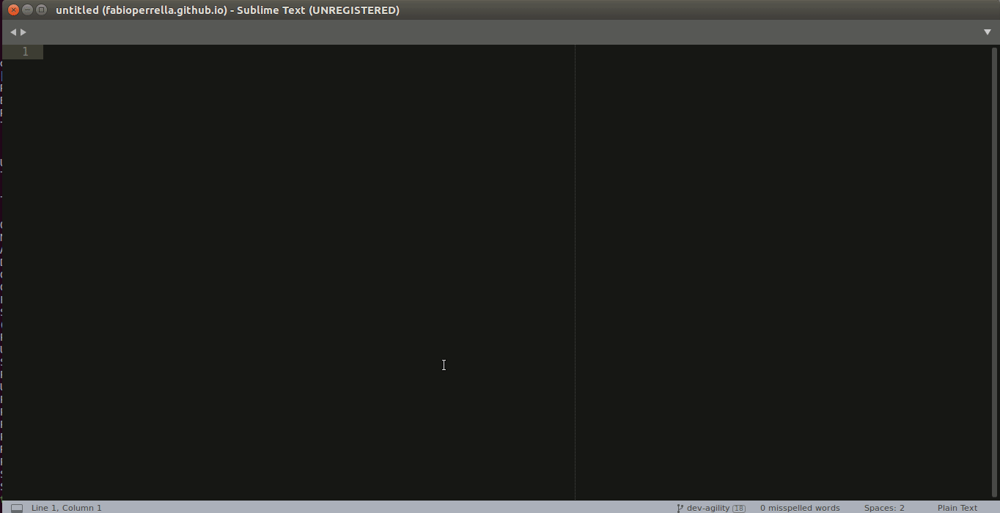
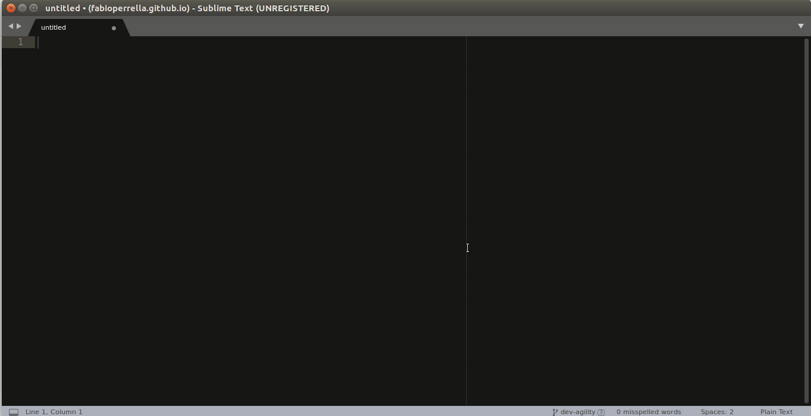
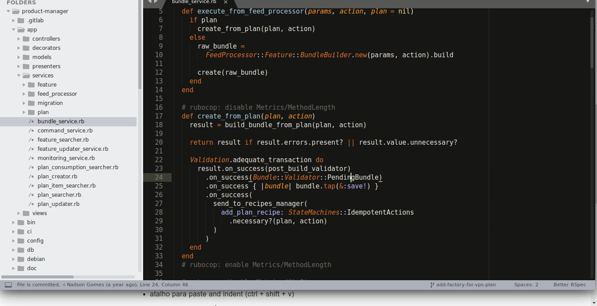
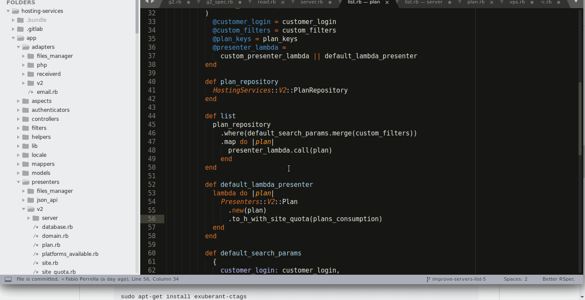

# Agility in software development - Text Editor

I've been programming for a while and every day I try to learn something new to
be more effective and fast.

I think every developer should care about it to improve their skills and lose
less time with repetitive and slow things.

When I'm pairing, people use to ask me how I do some things, what tools I use,
so I decided to share some things in this post.

My stack is the following:
- main language: ruby
- text editor: Sublime Text 3
- OS: Ubuntu 16.04
- terminal: gnome terminal with Tmux (I recently migrated from terminator and I
will explain why in a following post)

This is the 1st of N posts, and I will share a few things I use in the text
editor (which in my case is Sublime, but the actions should be applied in other
editors).

## Agility in text editor

### 1. Goto anything (or fuzzy finder)

I've seen some developers struggling to find a file in the source tree,
using the mouse, when they can use a much faster way to open the files.

Use the "goto anything" alias, type a piece of the file name and opens the file
**without touching the mouse**!

In sublime text 3, just use the alias `ctrl + p`:

### 2. Switch projects

In my opinion there as 3 ways to organize all the projects you work:

1. adding all folders (of each project) to the same workspace using only 1
instance of the text editor
2. creating a project (or workspace) for each project and keep open only 1
instance of the text editor
3. creating a project (or workspace) for each project and keep open
1 instance of the text editor for each project you are working on

In my opinion, the option 2 is the best to reduce the amount of files you can
search using the `goto anything` and to speed up when you need to open other
project.

In sublime, to switch to another project, just press `ctrl + alt + p`:

I also use the plugin [ProjectManager](https://github.com/randy3k/ProjectManager) to
help creating and organizing the projects. But it is possible to do it by
yourself.

### 3. Go to definition

If I was using an IDE or/and a static typed language, this should be the default
behavior, but using ruby (without Sorbet or something similar) and sublime text
it is not.

I've seen some devs using grep, awk or "find in project" to search for a
method definition, but with sublime there are other 2 ways faster to do it:

#### 3.1. Native go to definition (F12)

This command is native and tries to find the method definition, but it is not
always precise. To jump back were the cursor was, it is possible to use the
command `alt + -`

#### 3.2. Using CTags

[CTags](https://github.com/universal-ctags/ctags) is something magical that can
index the source code and help to find the definitions for a lot of languages.
It is not 100% precise, but I think it is better than the native one.

To use it, it is necessary to install the plugin [CTags](https://github.com/SublimeText/CTags).

First, it is necessary to build the index of the current project, just use `ctrl + t + r`.

Then, you can try to go to a definition using `ctrl + t + t`.

To jump back, you can use `ctr + t + b`.

Sometimes CTags will not be sure the method you want to go and will show the
options he found.

If both methods fail to find the definition, then I use the "find in project"
with `ctrl + shift + f`.

## Wrapping up

This is only the 1st part of others that I want to write about this subject.
If this help someone anyway, please add a comment.

See you!


